class: inverse


```{r, echo = FALSE}
library(fontawesome)
```


## Themen

- Monitoring von Nistkammern
- Nachweiserfolge von Spurentunnel-Untersuchungen
- Detektionswahrscheinlichkeit von Spurentunnel
- Asthaufen mit Fernerkundungsdaten detektieren
- Automatisierte Bilderkennung


---

class: inverse, center, middle
layout: false

## Monitoring von Nistkammern


---

class: inverse
layout: true

## Monitoring von Nistkammern

---


.center[]

---


- Zeitraum: April 2017 - August 2018
- Anzahl Einzelbilder: > 31'0000
- Bilderserien: > 11'000 "registrierte Besuche"


---


???

Die Anzahl registrierter Besuche ist unmittelbar
nach Erstellung des Asthaufens vergleichsweise
gering, nimmt aber schon im ersten halben Jahr zu
und erreicht nach 6 Monaten einen
Peak. Soviel Zeit brauchten die Tiere anscheinend,
um die neue Struktur zu finden und für sich
zu nutzen. So wurde die höchste Anzahl Besuche
(1669) im Monat Oktober, ziemlich genau sechs
Monate nach der Erstellung, registriert.


---

<iframe width="560" height="315" src="https://www.youtube.com/embed/L8GTrNWflxA" frameborder="0" allow="accelerometer; autoplay; clipboard-write; encrypted-media; gyroscope; picture-in-picture" allowfullscreen></iframe>

---

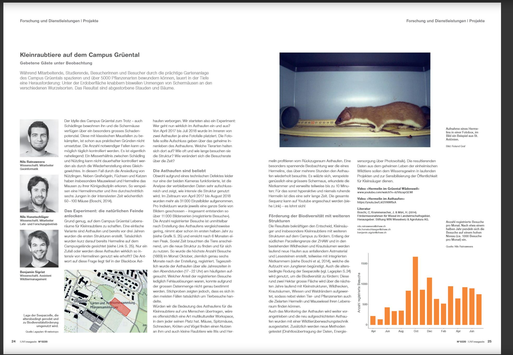

https://www.zhaw.ch/de/lsfm/institute-zentren/iunr/ueber-uns/iunr-magazin/
---

layout: false
class: inverse, center, middle

## Nachweiserfolge von Spurentunnel-Untersuchungen

---
class: inverse
layout: true

## Nachweiserfolge von Spurentunnel-Untersuchungen


---

Zieldefinition (Müri und Weinberger, 2015)

.footnote[Müri, H. und Weinberger, I. (2015): *Wiesellandschaft Schweiz: Erfolgskontrolle für intensive Wieselförderprojekte Kurzfassung für Projektleiter. WIN Wieselnetz - Erfolgskontrolle Wiesellandschaft (unveröffentlicht)*]


> Mind. 50 % der aufgewerteten Kleinstrukturen sollen von Wieseln (Hermelin oder Mauswiesel) begangen werden.

--

> In mind. 75 % der untersuchten Patches1 des Populationsraums sollen Nachweise von Hermelinen erbracht werden.

--

> In mind. 25 % der untersuchten Patches1 des Populationsraums sollen Nachweise von Mauswieseln erbracht werden.


---


> From: Ratnaweera Nils (rata)

> Sent: 02 September 2020 11:41

> To: ...

> Subject: Wiesel-Nachweiserfolg bei Attraktivitätskontrollen

> Hallo Miteinander,

> Wir sind gerade dabei, den Bericht für eine Wirkungskontrolle zu verfassen. Um unsere Resultate zu vergleichen wären wir sehr froh um Referenzwerte. Deshalb die Frage an euch: Welcher Anteil aller Spurentunnel haben in eurer Erfolgskontrolle mindestens einen Hermelinnachweis erzielt, und wie viele Spurentunnel habt ihr eingesetzt? Von ein paar Studien habe ich bereits die Daten erhalten (danke dafür!!) und habe diese in der nachstehenden Grafik visualisiert (die Zahlen habe ich selbst berechnet und muss ich noch überprüfen, ebenso die korrekte Zitierweise). Ich kann die Werte gerne in einer Tabelle allen zur Verfügung stellen, ich denke dies kann helfen die eigenen Resultate in einen Kontext zu setzen.


---

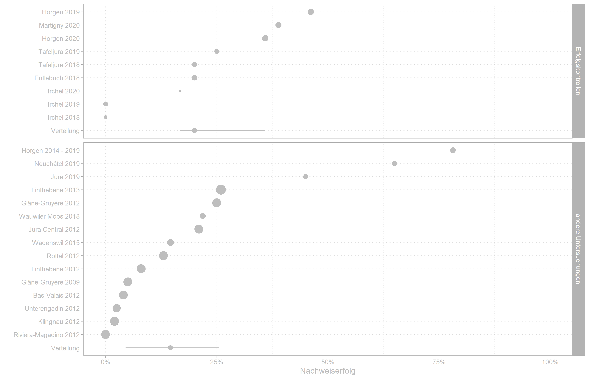


---


layout: false
class: inverse, center, middle

## Detektionswahrscheinlichkeit von Spurentunnel


---
class: inverse
layout: true

## Detektionswahrscheinlichkeit von Spurentunnel


.footnote[Steffen, F. (2020): Nachweiswahrscheinlichkeit von Hermelinen (Mustela erminea) mittels Spurentunnel. Bachelorarbeit. Zürcher Hochschule für Angewandte Wissenschaften ZHAW, Wädenswil]
---


.center[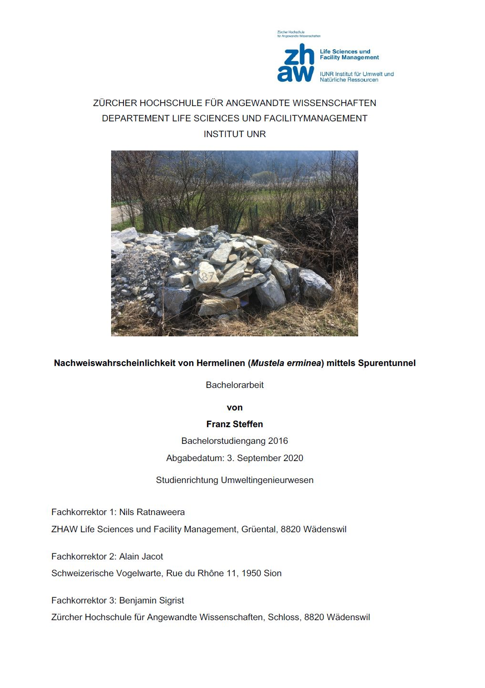]


???

Nun wurden die Daten aus den in der Schweiz
durchgeführten Monitorings und Erfolgskontrollen zusammengetragen, um auf dieser
Datengrundlage mit einem sogenannten «Site Occupancy Models» zu berechnen, wie
wahrscheinlich es ist, anwesende Hermeline mit dieser Methode nachzuweisen, und wie viele der
untersuchten Standorte effektiv durch Hermeline besetzt sind

---

.center[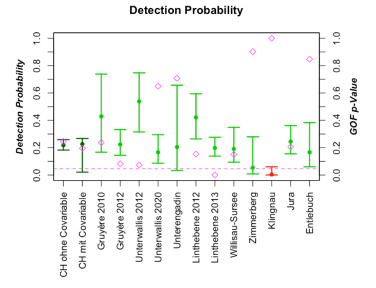]

> Es resultierte ein durchschnittlicher Wert von 22% Nachweiswahrscheinlichkeit.

???

Es resultierte ein durchschnittlicher Wert von 22% Nachweiswahrscheinlichkeit. Bei einer Mehrheit der durchgeführten Erhebungen liegt dieser Wert zwischen 29% und 24%, bei einer gesamten Bandbreite von 5% bis 54%.

---

.center[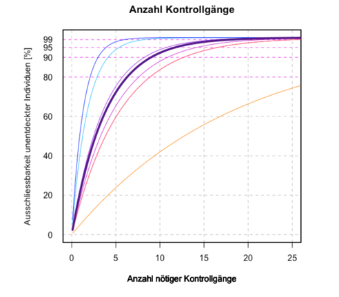]

> Mit einer Nachweiswahrscheinlichkeit von 22% kann bei einer Untersuchungsdauer von 6 Wochen zu 80% ausgeschlossen werden, dass anwesende Hermeline nicht nachgewiesen werden können.

> Für eine 95-prozentige Sicherheit ist der doppelte Aufwand von 12 Wochen nötig.

???

Mit einer Nachweiswahrscheinlichkeit von 22% kann bei einer Untersuchungsdauer von 6 Wochen zu 80% ausgeschlossen werden, dass anwesende Hermeline nicht nachgewiesen werden können. Für eine 95-prozentige Sicherheit ist der doppelte Aufwand von 12 Wochen nötig.

---

Die gesamte Arrbeit liegt auf der Dropbox: 

- [dropbox.com/home/Projektleiter Wieselnetz/Fachliteratur/Bachelorarbeit_Stefen.pdf](https://www.dropbox.com/s/6336pjbxfmml7nt/Bachelorarbeit_Steffen.pdf?dl=0)

---
layout: false
class: inverse, center, middle

## Asthaufen mit Fernerkundungsdaten detektieren


---
class: inverse
layout: true

## Asthaufen mit Fernerkundungsdaten detektieren


.footnote[Inauen, J. (2020): Wiesel-Habitatvernetzung in neuem Licht: Ein Ansatz zur Erfassung von Kleinstrukturen mittels LiDAR, Bachelorarbeit (unveröffentlicht), ZHAW, Wädenswil]
---


.center[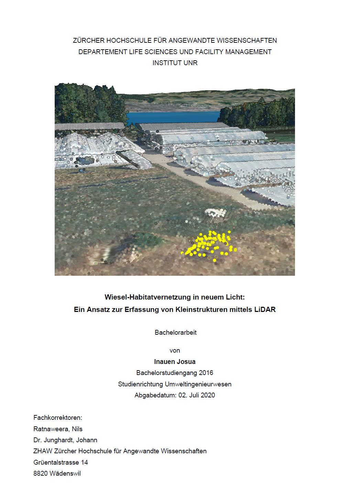]

---

.center[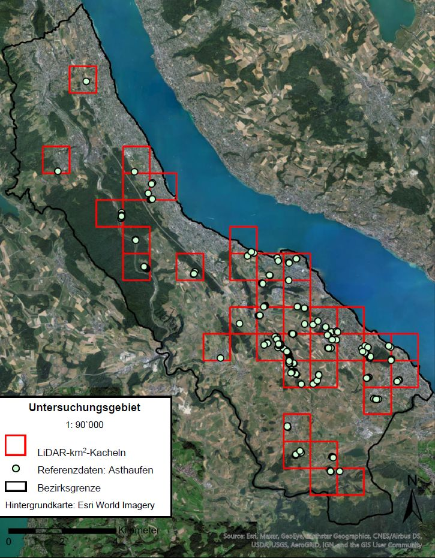]

---

.center[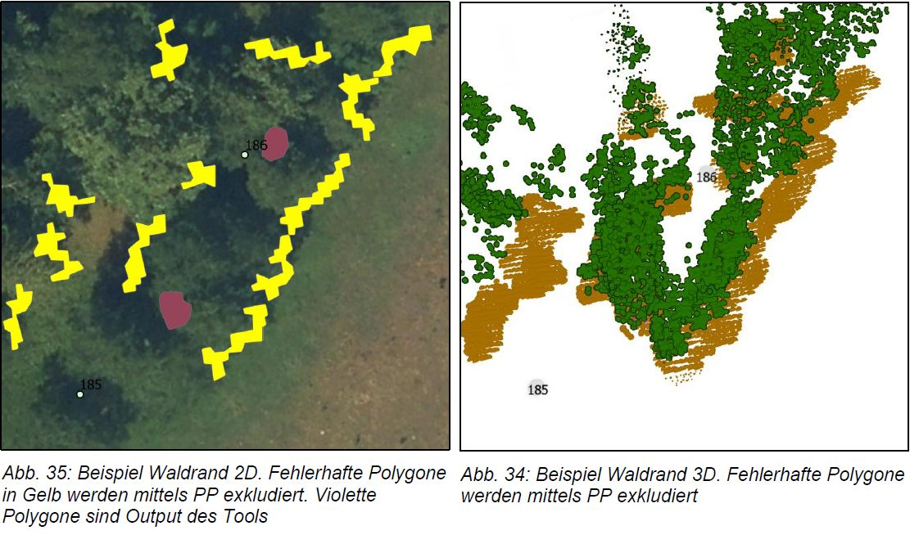]

---

.center[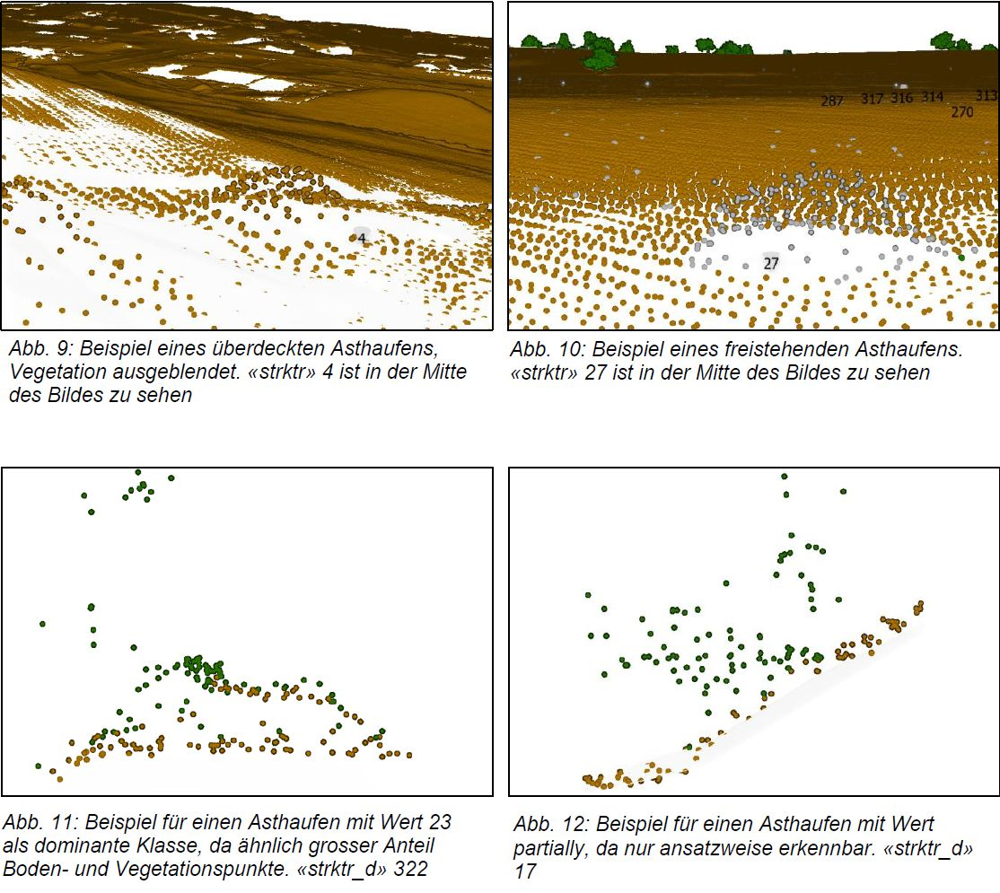]

---

.center[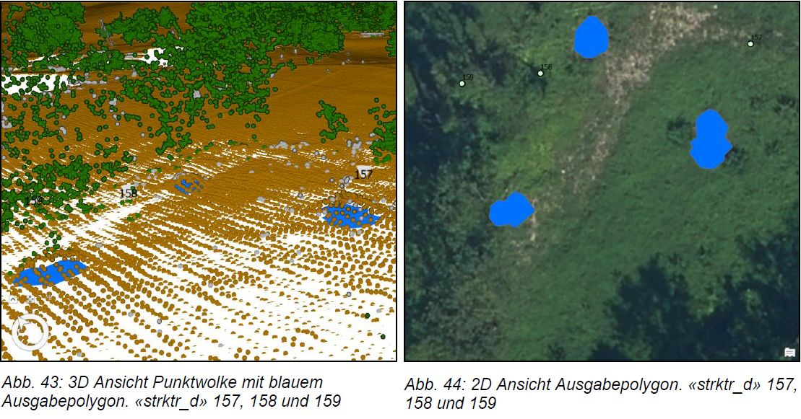]
---

.center[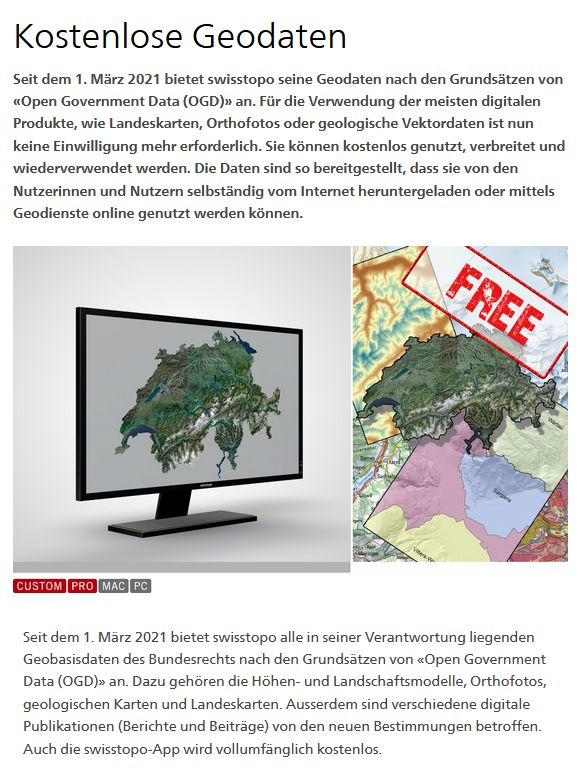]

---

layout: false
class: inverse, center, middle

## Automatisierte Bilderkennung


---
class: inverse
layout: true

## Automatisierte Bilderkennung

---


---

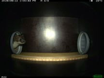
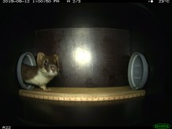
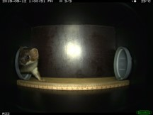
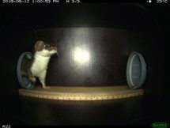
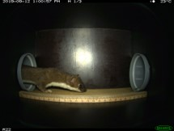
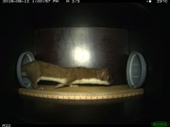
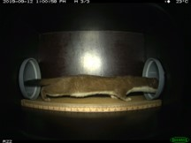
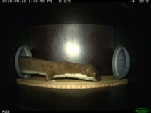

---

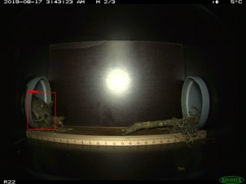
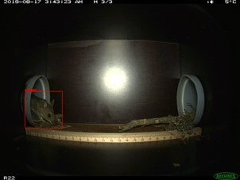
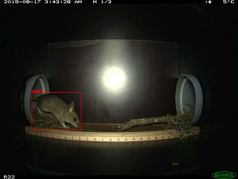

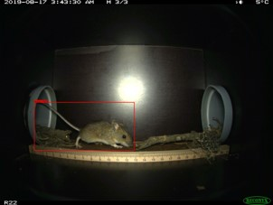
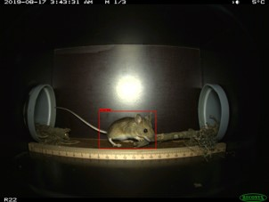
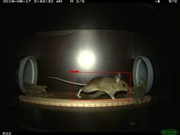
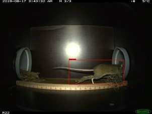
